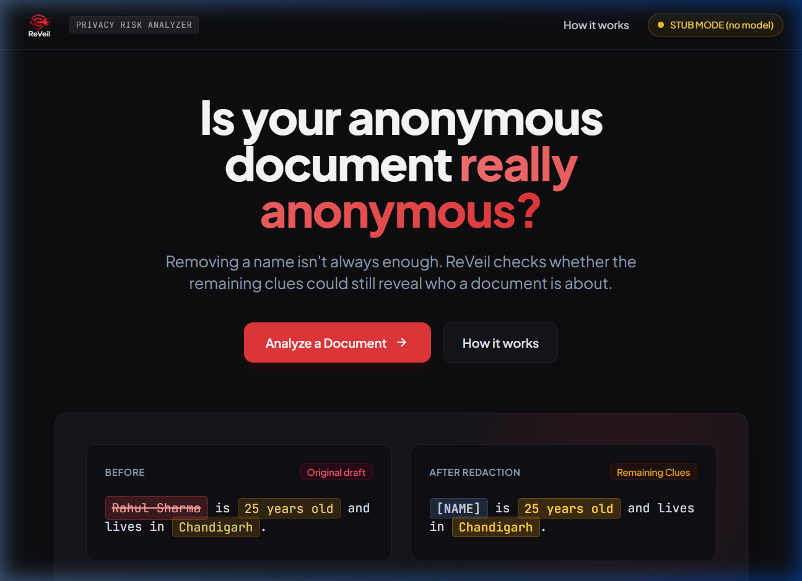
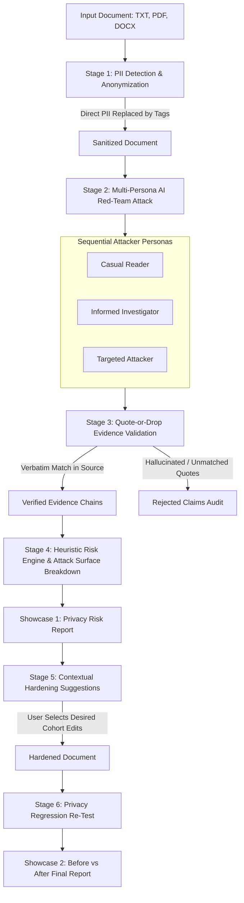
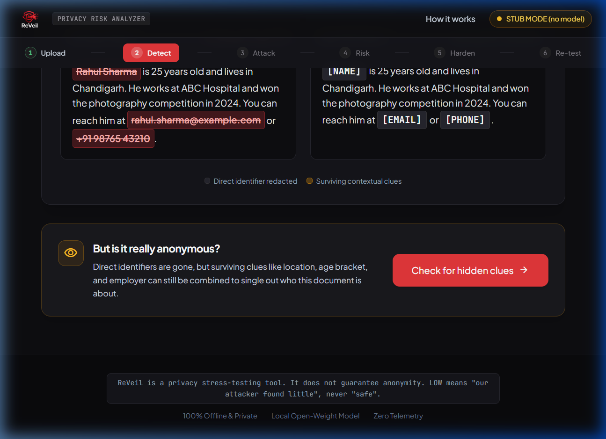
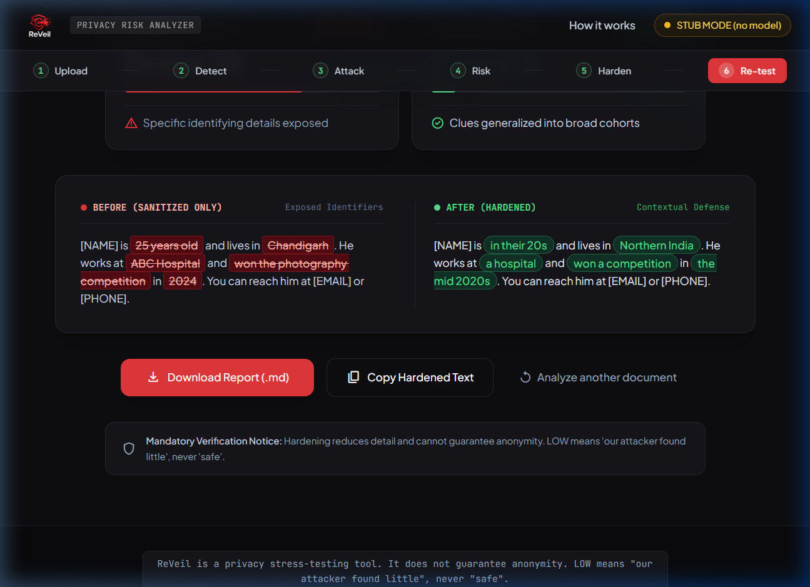

# ReVeil — AI-Powered Privacy Risk Analyzer

<div align="center">
  
  <br/>
  <p><strong>AI-powered privacy red-teaming for documents.</strong><br/><em>Reveal what anonymity hides.</em></p>
</div>

---

## Overview

**ReVeil** is an AI-powered privacy red-team tool that stress-tests anonymized documents against simulated adversary attacks. When sensitive documents are prepared for sharing, organizations typically scrub direct Personally Identifiable Information (PII) like names, email addresses, and phone numbers. However, stripping names is rarely sufficient: surviving contextual clues—such as age brackets, specialized job titles, municipal locations, dates, and distinct achievements—can intersect to single out an individual.

ReVeil challenges the illusion of anonymity. Operating entirely on local infrastructure with no cloud dependencies or telemetry, ReVeil takes sanitized text, simulates three distinct attacker personas using an open-weight language model (Qwen3 1.7B via Ollama), and rigorously verifies every AI finding against the source document using **quote-or-drop evidence validation**.

The platform categorizes surviving exposure across structured attack surfaces, computes a transparent heuristic privacy risk score, offers targeted contextual hardening suggestions (broadening specific details into wider cohorts), and automatically performs a **privacy regression re-test** to prove whether hardening meaningfully reduced re-identification risk.

> **Important Privacy Notice:** ReVeil is a privacy stress-testing tool; it is **NOT** a guarantee of anonymity or legal compliance. A "LOW RISK" score indicates that our simulated attacker personas identified few distinguishing breadcrumbs—it is never a guarantee that re-identification is impossible.

---

## The Problem

Traditional document redaction focuses almost exclusively on **direct identifiers**:

| Data Type | Description | Examples | Standard Treatment |
|---|---|---|---|
| **Direct PII** | Data that explicitly identifies an individual on its own | Full names, email addresses, phone numbers, national IDs | Scrubbed / Replaced with `[NAME]` |
| **Quasi-Identifiers** | Data points that do not name someone individually, but narrow the candidate group | City of residence, employer, age, graduation year | Often left intact |
| **Contextual Clues** | Unique narrative facts, specialized credentials, or milestones | Niche awards, specific committee roles, rare life events | Almost always overlooked |

### The Re-Identification Vulnerability

Consider the following progression:

```text
[Original Draft]
Rahul Sharma is 25 years old and lives in Chandigarh. He works at ABC Hospital and won the photography competition in 2024. Contact: rahul@example.com

[Direct PII Removed]
[NAME] is 25 years old and lives in Chandigarh. He works at ABC Hospital and won the photography competition in 2024. Contact: [EMAIL]

[Contextual Hardening Applied]
[NAME] is in their 20s and lives in Northern India. He works at a hospital and won a competition in the mid 2020s. Contact: [EMAIL]
```

In the second draft, the name and email are gone, but any local resident, coworker, or investigator with access to public records, LinkedIn, or news archives can quickly determine who won that specific competition at that specific hospital at that age. **Removing direct PII does not eliminate privacy risk.**



---

## How ReVeil Works

ReVeil evaluates documents through an automated multi-stage pipeline:



### Direct Identifier Redaction & Surviving Clues


---

## Attacker Personas

ReVeil executes three sequential attacker personas on the local model to stress-test the document from varying adversary capabilities:

| Persona | Role & Perspective | Focus Area | Example Inference |
|---|---|---|---|
| **Casual Reader** | Everyday audience scanning for immediate, prominent facts | Prominent cities, recognizable landmarks, unique ages, and explicit facts | *"Lives in Chandigarh and is 25 years old"* |
| **Informed Investigator** | OSINT researcher correlating workplace, location, and dates | Cross-referencing employer names, graduation years, job titles, and municipal regions against public directories | *"ABC Hospital + Chandigarh narrows candidate pool to staff directory"* |
| **Targeted Attacker** | Motivated adversary exploiting niche achievements and rare credentials | Unique awards, specific licenses, rare project titles, and distinct life events cross-referenced with registries | *"Won the 2024 photography competition singles out the exact individual"* |

To prevent CPU thread contention on local consumer hardware, personas run sequentially under an execution lock (`_LOCK`) in `backend/app/attacker.py`.

---

## Key Features

- **7-Screen Google Stitch SPA:** Fluid single-page workflow with zero external front-end build steps (Vanilla JS + HTML5 + CSS).
- **Multi-Format Document Ingestion:** Built-in extraction for `.txt`, `.md`, `.json`, `.log`, `.pdf` (selectable text via `pypdf`), and `.docx` (paragraphs and tables via `python-docx`).
- **Quote-or-Drop Evidence Validation:** Guarantees zero unverified AI claims by requiring character-for-character verbatim quote matches in source text.
- **Attack Surface Breakdown:** Classifies exposure across 7 distinct vectors: Direct PII, Location, Organization, Occupation, Age Band, Timeline/Events, and Other.
- **Pure SVG Dynamic Risk Visualization:** Responsive circular risk gauge and quasi-identifier weight distribution bars rendered in SVG/CSS without heavy charting dependencies.
- **Evidence Chains:** Transparent trace linking Category $\rightarrow$ Verbatim Quote $\rightarrow$ Reasoning $\rightarrow$ Weight $\rightarrow$ Discovered-by Persona.
- **Contextual Hardening & Utility Preservation:** Suggests clean cohort widening (e.g., city $\rightarrow$ geographic zone, age $\rightarrow$ decade) with a side-by-side utility impact analysis.
- **Privacy Regression Testing:** Re-analyzes the hardened document using the same attacker personas to verify and score the risk reduction delta.
- **Attack Replay Timeline:** Chronological audit trail showing execution times, findings counts, and mitigations across all attack phases.
- **Local AI Status Popover:** Verifiable runtime indicators showing local model status, inference runtime, and architecture details.
- **Comprehensive Markdown Export:** Downloadable `.md` privacy red-team audit report for compliance reviews.
- **Deterministic STUB Fallback Mode:** Allows instantaneous UI testing, offline demonstrations, and automated test execution without requiring Ollama.

---

## Evidence Validation (Quote-or-Drop)

Generative AI models are prone to hallucinations, false positives, and paraphrased text. ReVeil eliminates this problem with **Quote-or-Drop Validation**:

1. **Extraction:** The AI persona proposes identifying clues in JSON format with a supporting `"quote"`, `"category"`, and `"why"`.
2. **String Verification:** ReVeil verifies that `quote` exists **character-for-character verbatim** within the document text.
3. **Filtering:**
   - Quotes that do not exist verbatim in the source document are **dropped**.
   - Redaction placeholders (e.g., `[NAME]`, `[EMAIL]`, `[PHONE]`) are **dropped**.
   - Fragments under 2 characters are **dropped**.
4. **Auditability:** Discarded claims are not hidden—they are cataloged in an expandable **"Quote-or-Drop Audit: Rejected / Unsupported AI Claims"** panel with the exact rejection reason.

This guarantees that ReVeil's risk score is based strictly on facts present in the text.

---

## Attack Surface Breakdown

ReVeil analyzes contextual exposure across seven structured dimensions:

| Vector | Focus | Severity When Specific | Hardening Strategy |
|---|---|---|---|
| **Direct PII** | Leaked names, emails, phone numbers, Aadhaar/PAN IDs | `HIGH` (if unscrubbed) / `REMOVED` | Redaction tag (`[NAME]`, `[EMAIL]`) |
| **Location** | Specific cities, towns, neighborhoods, roads | `HIGH` / `MEDIUM` | Broaden to region or country zone |
| **Organization** | Specific companies, hospitals, schools, universities | `HIGH` / `MEDIUM` | Generalize to industry / sector type |
| **Occupation** | Distinctive medical, legal, or technical titles | `MEDIUM` / `LOW` | Broaden to occupational field |
| **Age Band** | Exact numerical age | `MEDIUM` / `LOW` | Convert to decade cohort (`20s`, `30s`) |
| **Temporal / Dates** | Exact calendar years, months, shift schedules | `MEDIUM` / `LOW` | Generalize to era (`mid 2020s`) |
| **Other / Niche** | Competition wins, grants, unique achievements | `MEDIUM` / `LOW` | Generalize to broad category |

---

## Privacy Risk Model

ReVeil evaluates privacy exposure using a **transparent, bounded heuristic sum**:

- **Not a Calibrated Probability:** The score is not an actuarial or statistical percentage of re-identification likelihood; it is a deterministic heuristic reflecting clue density and specificity.
- **Rule & AI Intersection:** Scores combine rule-detected quasi-identifiers (regex and gazetteer lookup) with AI-verified contextual findings.
- **Weighted Categories with Caps:**
  - Location clues: +3 pts each (capped at 6 pts)
  - Organization clues: +3 pts each (capped at 6 pts)
  - Age clues: +2 pts each (capped at 4 pts)
  - Temporal / Date clues: +1 pt each (capped at 3 pts)
  - Specific Roles: +2 pts each (capped at 4 pts)
  - Unique Achievements: +2 pts each (capped at 3 pts)
- **Risk Level Thresholds:**
  - **HIGH RISK:** Score $\ge 12$
  - **MODERATE RISK:** Score $6 - 11$
  - **LOW RISK:** Score $< 6$

---

## Supported Input Formats

ReVeil includes a client/server ingestion layer in `backend/app/extractor.py`:

| Format | Extension | Extraction Method | Status |
|---|---|---|---|
| **Plain Text** | `.txt`, `.md`, `.json`, `.log` | Direct text decoding (UTF-8 with Latin-1 fallback) | Fully supported |
| **PDF Document** | `.pdf` | Multi-page selectable text extraction via `pypdf` | Fully supported |
| **Word Document** | `.docx` | Paragraph & table extraction via `python-docx` | Fully supported |
| **Legacy Word** | `.doc` | Binary format detection; displays guidance to save as `.docx` | Informative guidance |
| **Image (OCR)** | `.png`, `.jpg`, `.jpeg` | Optional local OCR via Tesseract (if locally installed) | Requires local Tesseract |

> **Local OCR Notice:** To preserve local privacy, ReVeil never sends image uploads to external cloud OCR APIs. If Tesseract is not installed on the host machine, ReVeil displays a clear notification explaining that local OCR requires Tesseract installation (`winget install UB-Mannheim.TesseractOCR`).

---

## Architecture & Project Structure

ReVeil uses a lightweight architecture with no database, no front-end framework build steps, and no background broker queues:

```text
reveil/
├── backend/
│   ├── app/
│   │   ├── __init__.py
│   │   ├── attacker.py      # Multi-persona red team, prompts & quote-or-drop validation
│   │   ├── config.py        # Environment settings (Ollama URL, model name, caps)
│   │   ├── extractor.py     # Multi-format document ingestion (TXT, PDF, DOCX, OCR)
│   │   ├── hardening.py     # Contextual generalisation rules and text replacement
│   │   ├── main.py          # FastAPI application, static file serving & route handlers
│   │   ├── pii.py           # Regex PII scrubber and name replacement engine
│   │   ├── pipeline.py      # Analysis orchestrator linking PII, attacker, and risk
│   │   └── risk.py          # Heuristic scoring engine & attack surface categorization
│   └── tests/
│       └── test_core.py     # Comprehensive automated unit & integration test suite (23 tests)
├── frontend/
│   ├── app.js               # SPA state engine, SVG charts, diff renderer & export
│   ├── index.html           # 7-screen Google Stitch layout & design tokens
│   └── reveil-logo.png      # Official ReVeil brand logo asset
├── docs/
│   ├── .gitkeep
│   └── RESULTS.md           # Live test run results on synthetic samples via real Ollama
├── samples/
│   └── samples.json         # Realistic synthetic test cases (Photographer, Teacher, Surgeon)
├── scripts/
│   └── run_samples.py       # Batch pipeline evaluation runner for synthetic benchmarks
├── .env.example             # Example environment configuration
├── .gitignore               # Clean git exclusions (virtualenv, pycache, temporary files)
├── requirements.txt         # Core Python dependencies
├── run.bat                  # One-click Windows launch script (Ollama mode)
└── run_stub.bat             # One-click Windows launch script (STUB mode)
```

---

## Technology Stack

| Component | Technology | Role |
|---|---|---|
| **Frontend** | Vanilla JavaScript (ES6+), HTML5, CSS | Responsive 7-screen Single Page Application |
| **UI Design System** | Google Stitch Aesthetics, Tailwind CSS CDN | Curated dark mode (`#0e0e11`), red accents (`#E5383B`) |
| **Backend Framework** | Python 3.10+, FastAPI, Uvicorn | High-performance asynchronous API & static file server |
| **Local AI Engine** | Ollama Local API | Offline LLM inference runner on host machine |
| **AI Model** | Qwen3 1.7B (`qwen3:1.7b`) | Small open-weight model for sequential red-team analysis |
| **Document Ingestion** | `pypdf`, `python-docx`, `python-multipart` | Text extraction from PDF, DOCX, and plain text files |
| **Automated Testing** | Standard Library `unittest` runner | Zero-external-dependency test execution |
| **Database** | None | Stateless processing; documents are never saved to disk |

---

## Local AI & Privacy Guarantees

- **Local Inference:** AI inferences run on the user's host machine via Ollama's local HTTP API (`http://localhost:11434`).
- **No Cloud Inference:** Prompt payloads and document contents are never transmitted to external AI providers.
- **Stateless Backend:** Uploaded files and analyzed texts are processed in-memory and are never stored in a database or written to disk.
- **Untrusted Input Protection:** Document text is injected between `<DOC>` and `</DOC>` data boundaries with prompt injection neutralization.
- **Safe Rendering:** Extracted and hardened text is escaped before rendering to prevent Cross-Site Scripting (XSS).
- **Accurate Claims:** ReVeil does not make unverified claims such as *"100% on-device GPU"* or *"zero telemetry"* unless verified. The runtime health indicator clearly states:
  > `AI inference: Local machine (Qwen3 1.7B) · Document processing: Local backend`

---

## Getting Started & Installation

### Prerequisites

1. **Python 3.10, 3.11, or 3.12** installed on your system.
2. **Git** for version control.
3. **Ollama** installed from [ollama.com](https://ollama.com).

### Step-by-Step Setup

1. **Clone the repository:**
   ```bash
   git clone <repository-url>
   cd reveil
   ```

2. **Create and activate a Python virtual environment:**
   ```powershell
   # Windows (PowerShell)
   python -m venv .venv
   .\.venv\Scripts\Activate.ps1
   ```

3. **Install dependencies:**
   ```powershell
   pip install -r requirements.txt
   ```

4. **Pull the Qwen3 1.7B model:**
   ```powershell
   ollama pull qwen3:1.7b
   ```

5. **Start the application:**
   ```powershell
   # Using the included launch script:
   .\run.bat

   # Or starting manually:
   python -m uvicorn app.main:app --app-dir backend --host 127.0.0.1 --port 8000
   ```

6. **Open in browser:**
   Navigate to [http://127.0.0.1:8000](http://127.0.0.1:8000). The health indicator in the header will turn green when the model is ready.

---

## Running in STUB Mode (No LLM Required)

For rapid UI development, demonstration on resource-constrained systems, or automated testing without Ollama:

```powershell
# Using the included script:
.\run_stub.bat

# Or setting the environment variable manually:
$env:FAKE_LLM="1"
python -m uvicorn app.main:app --app-dir backend --host 127.0.0.1 --port 8000
```

In STUB mode, all AI calls return deterministic mock findings and all outputs are clearly labeled `STUB MODE`.

---

## Testing

ReVeil includes an automated test suite requiring no external test runner:

```powershell
.\.venv\Scripts\python.exe backend\tests\test_core.py
```

### Verified Test Suite (23/23 Passing)

```text
PASS test_regex_pii                          # Regex extraction for email, phone, Aadhaar, PAN
PASS test_names_and_titles                   # Name redaction with title prefix preservation
PASS test_anonymize_offsets_with_many_entities # Text boundary safety with overlapping entities
PASS test_hardening_rules_and_rescan         # Contextual generalisation rules
PASS test_more_hardening_cases               # Regional and age cohort boundary checks
PASS test_stale_edit_is_skipped              # Safety against concurrent edits
PASS test_validate_quote_or_drop             # Quote-or-drop exact string matching
PASS test_parse_json_with_think_and_noise    # Resilience against reasoning tags in small LLMs
PASS test_injection_text_is_delimited        # Prompt injection boundary neutralization
PASS test_risk_levels_and_dedupe             # Heuristic scoring deduplication and capping
PASS test_attack_against_mock_ollama         # Ollama API response parsing and validation
PASS test_unreachable_ollama_message         # Graceful error handling on server offline
PASS test_stub_mode_is_labelled              # STUB mode indicator compliance
PASS test_samples_file                       # Validation of synthetic benchmark samples
PASS test_multi_persona_structure            # Persona configuration and sequential execution
PASS test_quote_or_drop_rejection_reasons    # Accurate rejection reason auditing
PASS test_attack_surface_breakdown           # 7-vector attack surface categorization
PASS test_regression_retest_delta            # Hardening regression score delta verification
PASS test_api_response_schema_compatibility  # API JSON contract compatibility
PASS test_extract_txt_and_edge_cases         # Plain text and edge-case ingestion
PASS test_extract_docx                       # DOCX paragraph and table cell extraction
PASS test_extract_pdf                        # PDF selectable text stream extraction
PASS test_ocr_unavailable_guidance           # Local OCR guidance when Tesseract is absent
```

To run the synthetic sample batch benchmark through the live model:
```powershell
python scripts\run_samples.py
```
*(Results are automatically recorded in [`docs/RESULTS.md`](docs/RESULTS.md).)*

---

## Limitations

- **Heuristic Estimation:** The privacy risk score is an uncalibrated heuristic designed for comparative stress-testing; it is not a legal guarantee of anonymity under GDPR, HIPAA, or DPDP.
- **Model Constraints:** Small open-weight models (1.7B parameters) running on CPU have bounded world knowledge and may occasionally miss subtle contextual associations or generate paraphrased quotes (which are caught and rejected by quote-or-drop validation).
- **Rule Scope:** Built-in hardening rules currently focus on Indian cities, states, common professional titles, and standard English date/age formats. Unlisted locations or non-English text require manual hardening.
- **Scanned PDFs & OCR:** PDF extraction requires selectable text streams; scanned image PDFs require local Tesseract OCR.
- **Single Analysis Concurrency:** Sequential execution locks requests during model generation to protect host CPU resources.

---

## Hackathon Demo Walkthrough (3 Minutes)

1. **Screen 1 — Landing:** Click **"Analyze a Document"**. Notice the header health badge confirming `LOCAL AI · qwen3:1.7b`. Click the health badge to view the verified Local AI Architecture popover.
2. **Screen 2 — Upload:** Click **"Load synthetic sample"** (loads the Rahul Sharma photographer document) or upload a `.txt`, `.pdf`, or `.docx` file.
3. **Screen 3 — Detect:** Click **"Remove identifiers"**. Review the scrubbed direct PII (`[NAME]`, `[EMAIL]`, `[PHONE]`) and note the surviving contextual clues highlighted in amber.
4. **Screen 4 — Attack Simulation:** Click **"Check for hidden clues"**. Watch the animated radar shield as the 3 sequential attacker personas analyze the text on the local model.
5. **Screen 5 — Privacy Risk Report:** Review the Executive Risk Summary card, SVG circular risk gauge, Attack Surface Breakdown cards, Verified Evidence Chains, Persona Tabs, and the Quote-or-Drop Rejected Claims Audit accordion.
6. **Screen 6 — Contextual Hardening:** Click **"Harden my document"**. View suggested generalisations (e.g., *Chandigarh* $\rightarrow$ *Northern India*, *25 years old* $\rightarrow$ *in their 20s*) and review the Privacy vs. Content Preservation Analysis table.
7. **Screen 7 — Final Report:** Click **"Apply & re-test"**. Review the Before vs. After score reduction delta, the dynamic SVG score comparison chart, the Attack Replay progression timeline, and click **"Download Report (.md)"** to export the audit file.

### Before vs. After Privacy Verification Report


---

## Roadmap

- [ ] **Expanded Gazetteer Rules:** Additional geographic and regional taxonomy rules for North America, Europe, and Asia-Pacific.
- [ ] **Multi-Language Sanitization:** Multilingual regex patterns for non-English documents.
- [ ] **Local Differential Privacy Metrics:** Incorporating formal $k$-anonymity and $l$-diversity approximations for tabular data exports.
- [ ] **Automated PDF Export:** Direct PDF audit report generation alongside Markdown export.

---

## Contributing

Contributions to ReVeil are welcome!
1. Fork the repository.
2. Create a feature branch (`git checkout -b feature/new-hardening-rules`).
3. Ensure all tests pass (`python backend/tests/test_core.py`).
4. Commit your changes (`git commit -m "Add new regional hardening rules"`).
5. Push to your branch and open a Pull Request.

---

## License

This project is licensed under the Apache License 2.0. See the `LICENSE` file for details.

---

## Acknowledgements

- [Ollama](https://ollama.com) for local open-weight model serving.
- [Qwen Team](https://github.com/QwenLM/Qwen) for the Qwen3 language model family.
- [FastAPI](https://fastapi.tiangolo.com) and [Uvicorn](https://www.uvicorn.org) for the Python backend.
- [pypdf](https://github.com/py-pdf/pypdf) and [python-docx](https://github.com/python-openxml/python-docx) for document text extraction.
- [Google Stitch](https://stitch.withgoogle.com/) for UI visual design reference.
